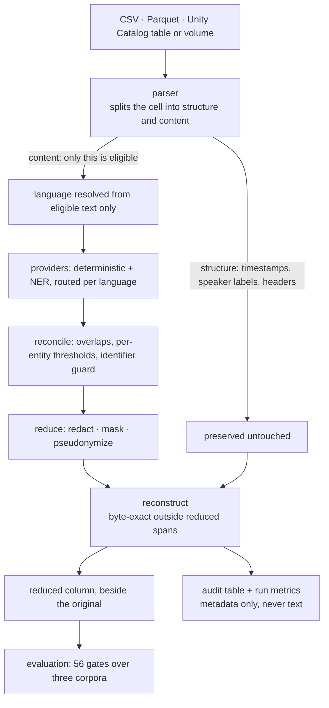

# Databricks PII Reduction Accelerator

[](https://github.com/soulipaco/pii-reduction/actions/workflows/ci.yml)
[](LICENSE)
[](pyproject.toml)
[](docs/adr/README.md)

> An open-source, multilingual, provider-agnostic accelerator for detecting, redacting, pseudonymizing, and benchmarking personally identifiable information (PII) in known free-text columns, locally and on Databricks.

<!-- "discovering" was deliberately removed from this line (session 9): the system
     detects entities inside columns the operator names — it has no estate or
     column discovery, and both external reviews independently flagged the word
     as the one misleading claim in this README (docs/17 §1.8). -->

**Structure-aware, not a regex sweep.** A ticket id survives; a timestamp and a speaker
label survive; the name and the email do not:

```diff
- Please email James Whitfield at maria.rossi@example.net about ticket INC00100000.
+ Please email <PERSON> at <EMAIL> about ticket INC00100000.

- 2026-04-03 09:15:13 - Guest: Hi, I'm Aisha Bello. Please call me on +1 202 555 0142.
+ 2026-04-03 09:15:13 - Guest: Hi, I'm <PERSON>. Please call me on <PHONE>.
```

*All examples above and below are from the committed synthetic corpus
(`tests/fixtures/corpus`, seed 42), reduced by the hybrid chain: generated names,
RFC-reserved email domains (ADR-0003), and phone numbers from published
permanently-unassigned ranges (ADR-0014). No real text appears anywhere in this
repository.*

**And it publishes what it gets wrong.** Greek, same run — `Παρακαλώ` ("please") taken
for a name while the actual name survived:

```diff
- Παρακαλώ στείλτε email στον/στην Μαρία Παπαδοπούλου στο maria.papadopoulou@example.net …
+ <PERSON> στείλτε email στον/στην Μαρία Παπαδοπούλου στο <EMAIL> …
```

That is not a bug awaiting a fix — it is a licence constraint with a measured cost. The
good Greek spaCy models are CC BY-NC-SA and cannot enter an MIT project (ADR-0007), so
Greek routes through a weaker multilingual model, the gap is diagnosed to three
mechanisms (ADR-0019), two are addressed (ADR-0020, ADR-0021), and Greek PERSON recall
is published as **0.500** rather than rounded up.

**Every number below is a regression gate**, not a claim: 56 of them, across three
corpora and both provider chains. **23 run on every push** — the model-free ones, which
is what lets them — and the 33 that need NLP models run nightly (ADR-0009). See
**[docs/22_EVIDENCE.md](docs/22_EVIDENCE.md)** for what has actually been executed —
including what has *not*.

## See it work in two minutes

```bash
pip install -e ".[dev,service]"   # no NLP model and no provider extra yet
pytest -q                         # 1380 tests, model-free and Spark-free
pii-reduction benchmark           # the measured baseline over the committed corpus
```

**That baseline is the deterministic chain, and it finds no names at all** — PERSON
precision and recall are `0.000`. That row is not a disappointment, it is the control:
it is why the NER chain's numbers mean something. To reproduce the `<PERSON>` examples
above you need the provider extras and the documented spaCy models
(`docs/15_PROVIDERS.md`):

```bash
pip install -e ".[presidio,language]"
python -m spacy download en_core_web_md   # + de_core_news_md, xx_ent_wiki_sm
pii-reduction benchmark --chain deterministic_presidio
```

Then drive it from a browser — pick a template, configure the columns, preview the
generated YAML, save it, run it, watch it finish:

```bash
pii-reduction-service --configs configs   # http://127.0.0.1:8000/
```

That control panel is one static file inside the wheel — no build step, no CDN, nothing
to deploy separately (ADR-0035) — so an App deploying this wheel serves exactly this
page. **To be precise about what has been executed: the service has been hosted as a
Databricks App and driven over HTTPS, but that deployment predates the panel and the App
is currently stopped**, so the panel itself is proven locally and not yet on the App
(`docs/22_EVIDENCE.md` §6). It shows configuration and run metadata and **never text**,
because no endpoint returns any (ADR-0026).

## How it fits together



**The parser boundary is the load-bearing part.** A provider is only ever handed the
segments the parser marked processable, so a timestamp cannot be damaged and a speaker
label cannot be redacted by accident — and the benchmark reports how much ground truth
the parser *never offered* (ADR-0028), because a miss nothing could have caught is not a
detection result.

## Deployment target

**Azure Databricks is the primary deployment target (ADR-0025), not one execution
surface among several.** Local execution is the development, test and evaluation
surface — and stays a hard engineering constraint, because it is what makes the
local/Databricks parity claim checkable: `pytest -q` runs model-free and
Spark-free, and nothing on the runtime path may import `pyspark`.

The intended shape is a ladder, each rung depending only on the ones below it:
the engine (this library) → a runbook-driven workspace run → a scheduled job or
Asset Bundle → a service layer over the engine. **All four rungs exist, and rung 4 has
been hosted: a Databricks App ran the service and answered every endpoint over HTTPS**
(session 12, `docs/19_SERVICE_LAYER.md`). That App is **stopped, not deleted** — it
proved what it was created to prove and compute is not free; the App, its `SUCCEEDED`
deployment and the staged workspace source all survive, so `apps start` plus
`apps deploy` brings it back. Rung 3's bundle is still undeployed — `bundle deploy` is
blocked by the Databricks CLI's expired Terraform signing key, which turned out never
to apply to Apps, since they deploy without a bundle. **Hosting does not make the App
authorize as the caller**: measured on the deployment, an App authenticates the end
user and reads data as its own service principal, so `docs/09`'s condition for a
side-by-side display surface is not met by hosting. Rung 4 is a thin HTTP API
(ADR-0026) under
`src/pii_reduction/service/`, served by `pii-reduction-service`; a Databricks App
is how it gets hosted rather than a second surface to build. Reduction logic never
moves upward into a notebook or a UI (`AGENTS.md` rule 3), and the service cannot
even import a provider or a reducer — an import allowlist says so, and a test
enforces it. No endpoint accepts or returns text of any kind
(`docs/19_SERVICE_LAYER.md`). PHI is a recorded horizon for the same
platform, not a claim about what is detected today — the shipped taxonomy is
`PERSON`/`EMAIL`/`PHONE`/`ADDRESS`, and `ADDRESS` is not yet detected at all
(ADR-0002).

## Why this project exists

Organizations increasingly store operational text alongside structured business data: support tickets, chat transcripts, call summaries, case notes, incident descriptions, resolution notes, emails, CRM comments, survey responses, and knowledge-work artifacts. These fields often contain PII even when the surrounding table is otherwise well governed.

PII reduction in those environments is not just a named-entity-recognition problem. A production-grade solution must also understand document structure, preserve non-sensitive metadata, support multiple languages, work at data-platform scale, expose measurable quality, and integrate cleanly with governance and downstream analytics.

This repository is intended to demonstrate that full problem, end to end.

The accelerator is designed around five principles:

1. **Source-agnostic:** the PII engine should not care whether input comes from Excel, CSV, Parquet, Delta, or an existing Databricks table.
2. **Structure-aware:** transcript speaker labels, timestamps, ticket headers, and other operational metadata should be preserved when only the conversational or note body is in scope.
3. **Multilingual:** language detection and language-aware recognizers are first-class parts of the pipeline rather than afterthoughts.
4. **Provider-agnostic:** Presidio, transformer-based NER, deterministic recognizers, and Databricks-native or model-serving approaches should be interchangeable behind a common interface.
5. **Measurable:** every provider and pipeline version should be evaluated against reproducible ground truth using entity-level and document-level metrics.

## Repository status

**The `docs/11_ROADMAP.md` build order is complete through Phase 6.** Shipped and
measured: CSV/pandas sources, plain-text and transcript parsers, deterministic
EMAIL/PHONE and Presidio NER providers, language detection with per-language provider
routing, entity reconciliation, redact/mask/pseudonymize reducers, local outputs with
run metrics and run provenance, a seeded synthetic corpus with an injection manifest,
three public-dataset packs built from pinned checksummed sources, the evaluation
framework with its gate runner, and a Databricks execution surface whose local/remote
parity is asserted against a real workspace (the driver path; the distributed
`mapInPandas` path is shipped but has never executed — the workspace's serverless
sandbox is infra-blocked, plan §8 F).

The architecture, data contracts, security model and contribution rules that framed
all of it are in `docs/`, and every non-obvious choice has a decision record under
`docs/adr/`.

Every number published below is enforced rather than only reported: they are locked as regression gates in `configs/benchmark_gates.yaml` and checked by CI on the committed corpus. The public-dataset packs carry their own gate sets under `configs/pack_gates/`, measured on their own corpora — never a reason to loosen the synthetic floors.

**Released as `v0.1.0`** (2026-08-22). `CHANGELOG.md` is the entry point for someone
arriving cold. `docs/14_IMPLEMENTATION_PLAN.md` §8 carries the measured baseline and
the register of everything parked, each with the condition that would reopen it —
**there is no queue.** The charter's definition of done is met in all nine items, and
what is unbuilt is roadmap rather than debt.

As of the release (`v0.1.0`): **1240 default-tier tests**, 97 integration, **56
regression gates across three corpora** and both provider chains, **33 ADRs at the
tag** — the badge at the top of this file counts the current 36 — CI green on Linux and
Windows. No published benchmark number has ever moved without being re-measured.

**Since the release**, a line of work on top of it has made the shipped engine usable
rather than more capable — the accuracy knobs reachable through the API (ADR-0034), a
control panel that renders them (ADR-0035), and an upload path that never gives the
service the file (ADR-0036). No detection capability changed and no published number
moved; see `CHANGELOG.md`'s *Unreleased*. Current: **1380 default-tier tests**, 97
integration, 1 packaging, 56/56 gates unchanged, **36 ADRs**.

### Every way to run it

The two-minute version is at the top of this file. In full:

```bash
pip install -e ".[dev]"
```

That is the whole install: no NLP model, no provider extra. Then run the benchmark over the committed synthetic corpus:

```bash
pii-reduction benchmark
```

Measured baseline (`deterministic_only` chain, `redact` strategy, 102 documents, 180 injected entities): EMAIL and PHONE strict precision/recall/F1 of 1.000 in every language and tier, over-redaction 0.000, and **PERSON strict recall 0.000 over a support of 78** — deterministic recognizers cannot find names.

Adding the NER provider (requires the `presidio` extra and the models documented in `docs/15_PROVIDERS.md`):

```bash
pii-reduction benchmark --chain deterministic_presidio
```

Either chain can be checked against its locked floors, which is what CI does — it exits non-zero if a gate fails:

```bash
pii-reduction benchmark --gates configs/benchmark_gates.yaml
```

To run an actual reduction over a dataset you configured (session 9 — previously
the Python API was the only front door):

```bash
pii-reduction run <dataset-name> --configs configs
```

It loads the source, processes, writes the configured artifacts, prints a
metadata-only summary, and exits 1 if any field failed — partial output must
look like a failure to a scripted caller (ADR-0023's fail-closed default writes
no reduced value for failed fields).

Before that, check the configuration against what the source actually has — **without
reading a row** (ADR-0031):

```bash
pii-reduction describe <dataset-name> --configs configs
```

It prints the source's columns, marks the ones your configuration processes and the one
it uses as the row id, and exits 1 when a configured column is missing, the row id is
absent, or an output column already exists. All three are otherwise failures you meet
after the load.

On the deployment target, the same reduction runs from a dataset config that names
a Unity Catalog table (session 10, ADR-0025):

```bash
pii-reduction-databricks run <dataset-name> --configs configs
```

Run it from the venv that has the `databricks` extra — Databricks Connect couples
client and server versions, so it lives in its own environment rather than the core
one (ADR-0006). It is a separate console script rather than a flag, because the core
CLI must stay importable with no Spark installed. Configuration names the table and the
`catalog.schema` written to; the runtime supplies the session from whichever
credentials your workspace permits — a CLI profile, `DATABRICKS_HOST` plus a token or
service principal, or the ambient credentials of Databricks compute. No host or token
is ever a parameter, in any signature or config key. `configs/datasets/databricks_table_example.yaml` is
the shape to copy — the placeholders in it are not a real workspace.
`docs/18_RUNBOOK_DATABRICKS.md` is the ten-minute walkthrough, including where the
outputs land, which of them still contain the original text, and the rules for
running real data through it.

Or drive it from a browser. `pii-reduction-service` serves a **control panel** — pick a
template, configure the columns, preview the generated YAML, save it, run it, watch the
run finish:

```bash
pii-reduction-service --configs configs
```

Then open `http://127.0.0.1:8000/`. The same page is what a Databricks App serves, and
it is one static file inside the wheel: no build step, no CDN, nothing to deploy
separately (ADR-0035). `--no-ui` turns it off and leaves the API unchanged. The
generated API reference is at `/docs`.

**The panel shows configuration and run metadata, never text** — because no endpoint
returns any (ADR-0026).

| metric | `deterministic_only` | `deterministic_presidio` |
|---|---|---|
| strict F1 | 0.723 | 0.910 |
| leakage rate | 0.433 | 0.067 |
| fragment leakage rate | 0.433 | 0.067 |
| document clean rate | 0.161 | 0.871 |
| over-redaction rate | 0.000 | 0.000 |

Both leakage metrics are published because agreement between them is a *result*, not a
tautology. `leakage rate` counts an entity leaked only when its exact full surface
survives; `fragment leakage rate` counts any surviving 4-character window, so a
boundary error that redacts half a name shows up in the second and not the first.
They agree here, which is the claim being made. They briefly did not: ADR-0020 opened a
0.011 gap by detecting two Greek surnames without their given names, and ADR-0021's
span extension closed it.

PERSON recall reaches 1.000 for German and 0.889–1.000 for English across every difficulty tier, but **0.000–0.667 for Greek**. The good Greek spaCy models are non-commercial and excluded on licensing grounds (ADR-0007), so Greek routes through a multilingual model — but that is only part of the story. Measured directly (ADR-0019), the model usually *finds* the Greek names and then gets the boundary or the label wrong, so two of the three mechanisms behind that number are not licensing problems at all. Acting on two of them cut whole-corpus leakage 0.117 → 0.067 and took Greek tier-2 recall 0.111 → 0.667: ADR-0020 promotes `LOCATION`/`ORGANIZATION` spans to PERSON for Greek, and ADR-0021 extends a PERSON span over a preceding token when that is structurally safe. Both are Greek-scoped — English and German are numerically unchanged — and the net cost is PERSON precision 0.833 → 0.771. The third mechanism is untouched: the model simply not finding the name is now the majority of what remains, and no boundary or label rule can reach it. `docs/15_PROVIDERS.md` publishes the gap per language and tier rather than reporting an average that hides it.

To regenerate the corpus (same seed gives a byte-identical corpus and manifest):

```bash
python demo/build_corpus.py --out tests/fixtures/corpus --seed 42
```

### Public-dataset demo packs

The corpus above is templates this project wrote, so a provider that does well on it has
only been asked an easy question. Three packs measure the same pipeline on text written
by other people, with synthetic PII injected into it so the ground truth is still exact:

```bash
python demo/build_pack.py support_tickets
pii-reduction benchmark --corpus demo/packs/support_tickets --chain deterministic_presidio
```

| pack | source | shape |
|---|---|---|
| `support_tickets` | Bitext customer support (CDLA-Sharing-1.0) | English support notes |
| `support_conversations` | the same exchanges, as Customer/Agent turns | English transcripts |
| `multilingual_utterances` | MASSIVE (CC BY 4.0) | short lower-case German and Greek |

**No raw data and no pack is committed.** Each source file is fetched from a pinned
commit revision and verified against a SHA-256 recorded in `demo/registry.yaml`
(ADR-0017), so a pack is rebuilt rather than stored. The registry is a gate, not a
document: an unregistered dataset, a non-permissive licence, or a source carrying real
personal data is refused before anything downloads — which is how MultiWOZ 2.2 left the
demo set once its published text turned out to contain real Cambridge phone numbers
(ADR-0018).

On the packs, EMAIL and PHONE hold at 1.000 precision and recall across 1,600 entities
in three languages, and the hybrid chain reaches strict F1 0.998–0.999 on English with
leakage 0.000. The interesting numbers are elsewhere: PERSON *precision* is 0.985–0.995
because public prose contains names no manifest knows about, and Greek PERSON recall is
0.727 against 0.556–0.667 on the synthetic corpus with the same model (both sides moved with ADR-0020 and ADR-0021, from 0.606 and 0.111–0.222) — which is
**easier Greek, not better detection**: single short clauses avoid all three of the
failure modes the synthetic templates trigger (ADR-0019). `docs/14_IMPLEMENTATION_PLAN.md`
§8 publishes all of it beside the synthetic numbers, with the limitations that keep it
honest.

The recommended first implementation is a public-data demo with three families of text:

- customer-support tickets,
- multi-turn customer/agent conversations,
- ServiceNow-style incident notes generated from public or synthetic content.

Synthetic PII is injected into public-safe text so the project can measure precision, recall, F1, and leakage without publishing real personal information.

## What the final accelerator should support

The lists below are the intended scope. Each is annotated with what is **shipped
today**, so the ambition and the state of the code cannot be confused for one another.
`docs/14_IMPLEMENTATION_PLAN.md` §8 is the authoritative status.

### Sources

- Excel workbooks with multiple sheets
- CSV files and folders of CSV files
- Parquet
- local pandas DataFrames for development
- Spark DataFrames
- Delta tables
- fully-qualified Unity Catalog tables

*Shipped: CSV, Parquet, local pandas, and Unity Catalog tables through a Spark session
(`SparkTableSource`). Excel is not implemented.*

### Text structures

- plain free text
- transcript / diarized conversation text
- ServiceNow-style work-note histories
- key/value case summaries
- email-like text
- configurable custom parsers

*Shipped: plain free text and transcript/diarized text, both with byte-exact
reconstruction, plus a `key_value` parser and a `split_lines` option on the plain
parser. The last two are registered and configurable but enabled nowhere: both were
measured against the English key/value problem and lost to a span repair that fixes
the model's output instead of re-cutting its input (ADR-0016). Work-note histories and
email-like text are not implemented.*

### PII entity families

Initial baseline:

- person names
- email addresses
- phone numbers
- physical addresses (in taxonomy and benchmarks from the start; detection deferred
  to a later provider — see `docs/adr/0002-address-entity-deferred.md`)

Designed for future extension to:

- dates of birth
- government identifiers
- account numbers
- financial identifiers
- IP addresses
- device identifiers
- user IDs
- health identifiers
- geolocation
- custom organization-specific entity types

### Reduction strategies

- redaction: `<PERSON>`, `<EMAIL>`, `<PHONE>`, `<ADDRESS>`
- masking: `jo***@example.com`
- deterministic pseudonymization
- reversible pseudonymization when explicitly configured and appropriately secured
- drop / suppress for selected entity types

*Shipped: redaction, masking and deterministic pseudonymization, all three measured
side by side (`--strategy`). Reversible pseudonymization and drop/suppress are not
implemented; reversibility in particular needs a key-management design this project
has not taken.*

### Providers

The pipeline should support a common `PIIProvider` abstraction, allowing implementations such as:

- Microsoft Presidio
- spaCy-backed Presidio engines
- transformer / Hugging Face NER
- GLiNER-style zero-shot entity detection
- deterministic recognizers for high-precision patterns
- Databricks-native AI or model-serving implementations where appropriate
- hybrid ensembles

*Shipped: a deterministic recognizer (EMAIL, PHONE) and a Presidio/spaCy adapter
(PERSON), composed as a hybrid chain and routed per language. Two Presidio instances
serve different languages with different options (ADR-0020, ADR-0021). Transformer NER,
GLiNER and Databricks-native providers are roadmap Phase 7 — GLiNER subject to the
CPU-only constraint of ADR-0015.*

No single provider is assumed to be best for every language or entity type. The
measured numbers in `docs/15_PROVIDERS.md` are the evidence for that claim rather than
an assertion of it: the deterministic recognizers beat the NER on their own entities,
and the NER is the only thing that finds names.

## Conceptual pipeline

```text
Data Source
   |
   v
Source Adapter
   |
   v
Dataset Contract + Column Policy
   |
   v
Text Parser / Segmenter
   |
   +---- plain text
   +---- transcript turns
   +---- note blocks
   +---- key/value sections
   |
   v
Language Detection
   |
   v
PII Provider(s)
   |
   v
Entity Reconciliation
   |
   v
Reduction Strategy
   |
   v
Reconstruction
   |
   +---- preserve timestamps
   +---- preserve speaker labels
   +---- preserve note headers
   +---- preserve row grain
   |
   v
Validation + Metrics + Audit Events
   |
   v
Output Adapter
   |
   +---- local file
   +---- pandas
   +---- Spark
   +---- Delta / Unity Catalog
```

## Repository layout

As built. Every path below exists; nothing here is aspirational.

```text
.
├── README.md · AGENTS.md · CLAUDE.md · CONTRIBUTING.md · SECURITY.md · LICENSE
├── pyproject.toml            # src layout, optional extras (ADR-0008)
├── .github/workflows/        # ci.yml (every push, model-free) + integration.yml (nightly)
├── docs/
│   ├── 00_PROJECT_CHARTER.md … 13_PORTFOLIO_STORY.md
│   ├── 14_IMPLEMENTATION_PLAN.md   # §8 is the live status and work queue
│   ├── 15_PROVIDERS.md             # shipped providers, licences, measured results
│   ├── 16_BENCHMARK_REPORT_10K.md  # the 10k-document two-chain comparison
│   ├── 18_RUNBOOK_DATABRICKS.md    # run it on your own table, in ten minutes
│   ├── 19_SERVICE_LAYER.md         # rung 4: the HTTP API, and what it refuses
│   ├── 20_ALTERNATIVE_RECONCILIATION.md  # a second implementation, compared item by item
│   ├── 21_FINALIZATION.md          # what "done" means, and the shortest path to it
│   └── adr/                        # decision records, indexed in adr/README.md
├── databricks.yml · resources/  # Asset Bundle + job skeleton (never deployed)
├── configs/
│   ├── project.yaml · providers.yaml   # entities.yaml/languages.yaml optional
│   ├── service_templates.yaml # what the service layer offers, and what it fixes
│   ├── datasets/             # one dataset contract per file
│   ├── benchmark_gates.yaml  # the committed corpus's regression floors
│   └── pack_gates/           # one gate set per public-dataset pack
├── src/pii_reduction/
│   ├── contracts/            # typed core objects; imports nothing else in the project
│   ├── config/ entities/ language/ patterns.py
│   ├── sources/ parsers/ providers/ reducers/ outputs/
│   ├── processing/           # the pipeline: parse → language → detect → reconcile → reduce
│   ├── evaluation/ observability/
│   ├── synthetic/            # build-time corpus, injection and pack builders
│   ├── databricks/           # execution surface: Spark source, Delta output, runners
│   ├── service/              # rung 4: the HTTP API. Owns no reduction logic
│   └── cli.py · benchmark.py # entry points
├── tests/                    # fast tier by default; integration/slow/databricks marked
├── demo/                     # runnable front doors; the logic lives in synthetic/
└── data/downloads/           # fetched public datasets, gitignored and checksummed
```

One directory the original plan named is still deliberately absent: there is no
`notebooks/`. The Databricks entry points are importable modules under
`src/pii_reduction/databricks/`, because a notebook is not testable and `AGENTS.md`
forbids logic living in one. `resources/` now exists — session 10 added the Asset
Bundle and job skeleton (ADR-0025 rung 3) — and it is a **skeleton that has never
been deployed**. A default-tier test holds the one promise that can be held without
a workspace: that no host, catalog, cluster id, secret, personal workspace path or
email address is hard-coded in any deployment file, discovered rather than listed so
a new one cannot slip past the guard.

## Implementation philosophy

The repository should avoid becoming a notebook collection. Business logic belongs in importable Python modules. Notebooks should only orchestrate or demonstrate those modules.

The local development path should be able to run without Databricks. The Databricks path should reuse the same pipeline components rather than maintaining a separate implementation.

The core library should be testable with synthetic data in seconds. Larger public datasets are demo and benchmark assets, not a dependency for running the unit-test suite.

## Public-data policy

The repository must not contain:

- proprietary corporate exports,
- copied production transcripts,
- real customer names or contact information,
- secrets or tokens,
- raw datasets whose redistribution license does not permit inclusion.

Preferred approach:

1. download or reference a public-safe dataset,
2. normalize it into the accelerator's canonical text contracts,
3. inject synthetic PII with deterministic seeds,
4. store ground-truth entity spans separately,
5. run detection and reduction,
6. evaluate the output against the injected ground truth.

See `docs/02_PUBLIC_DATA_STRATEGY.md`.

## Success criteria

A mature version of this repository should make it possible to answer all of the following with evidence:

- How accurately does each PII provider detect each entity type?
- How does performance differ by language?
- How does performance differ by document structure?
- What percentage of fields still contain known PII after reduction?
- How often does the system over-redact non-PII operational identifiers?
- Does transcript reconstruction preserve speaker metadata exactly? *(Yes, under the
  shipped default — and ADR-0032 rules on the case where you would rather it did not,
  because your speakers are named people rather than roles.)*
- Does the same configuration behave consistently locally and on Databricks?
- How does throughput scale as text volume increases?
- What are the quality/cost tradeoffs of deterministic, NER, and AI-based approaches?

## Non-goals

This project is not intended to claim that automated PII reduction guarantees regulatory compliance. It is an engineering and evaluation accelerator. Production adoption requires organization-specific legal, security, privacy, retention, and model-risk review.

The project should also avoid pretending that every identifier is PII. Entity scope must be explicit and configurable.

## Documentation map

- **Project purpose and boundaries:** `docs/00_PROJECT_CHARTER.md`
- **Technical design:** `docs/01_ARCHITECTURE.md`
- **Public datasets and synthetic PII:** `docs/02_PUBLIC_DATA_STRATEGY.md`
- **Canonical schemas and contracts:** `docs/03_DATA_CONTRACTS.md`
- **PII provider and reduction engine:** `docs/04_PII_ENGINE.md`
- **Language-aware processing:** `docs/05_MULTILINGUAL_STRATEGY.md`
- **Configuration model:** `docs/06_CONFIGURATION_CONTRACT.md`
- **Databricks execution model:** `docs/07_DATABRICKS_RUNTIME.md`
- **Metrics and benchmarking:** `docs/08_EVALUATION_BENCHMARKING.md`; the 10k-document two-chain comparison is `docs/16_BENCHMARK_REPORT_10K.md`
- **Security and privacy:** `docs/09_SECURITY_PRIVACY_GOVERNANCE.md`
- **Test strategy:** `docs/10_TESTING_QA.md`
- **Implementation roadmap:** `docs/11_ROADMAP.md`
- **Portfolio demo scenarios:** `docs/12_DEMO_SCENARIOS.md`
- **How to present the project:** `docs/13_PORTFOLIO_STORY.md`
- **Build sequence and increments:** `docs/14_IMPLEMENTATION_PLAN.md`
- **Shipped providers, licences and measured results:** `docs/15_PROVIDERS.md`
- **Running it on your own Databricks table:** `docs/18_RUNBOOK_DATABRICKS.md`
- **The service layer (rung 4) and what it refuses to do:** `docs/19_SERVICE_LAYER.md`
- **A second implementation of the same problem, compared item by item — what was
  adopted, what was refused, and why:** `docs/20_ALTERNATIVE_RECONCILIATION.md`
- **What "finished" meant, and the course that reached it:** `docs/21_FINALIZATION.md`
- **What has actually been executed — including what has not:** `docs/22_EVIDENCE.md`
- **Taking it public: what is owed, and what is left to decide:** `docs/23_HANDOVER_PUBLIC.md`
- **A four-minute walkthrough script, with what not to claim:** `docs/24_WALKTHROUGH_SCRIPT.md`
- **What shipped, in one page, for someone arriving cold:** `CHANGELOG.md`
- **Decision records:** `docs/adr/`

## License

**MIT** (`LICENSE`). The choice is recorded in ADR-0007 and it constrains what may be
depended on: the good Greek spaCy models are CC BY-NC-SA (non-commercial) and are
therefore excluded, which is why Greek routes through the multilingual `xx_ent_wiki_sm`
and why the provider refuses to be configured with them. A test asserts the licence
file and that exclusion together.

Dataset licences are tracked separately from the code licence, as they must be. No
public dataset is redistributed here — packs are rebuilt on demand from a pinned
revision with a recorded checksum (ADR-0017), and each pack's `meta.json` carries its
source licence, attribution requirement and share-alike flag.

**Attributions are in [`NOTICE`](NOTICE)** — Bitext under CDLA-Sharing-1.0 (share-alike)
and MASSIVE under CC BY 4.0 (attribution, and an indication that changes were made;
synthetic PII is injected into both). That file also records the datasets that were
assessed and **rejected**, with the reason — MultiWOZ 2.2 because its published
utterances carry real telephone numbers and postcodes (ADR-0018).
